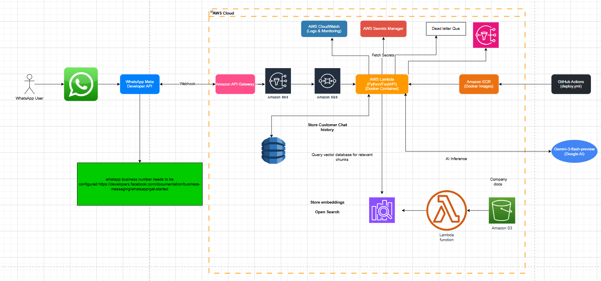

# RAG Based chatbot integrated with whatsapp

## Problem

To create a RAG based chatbot to answer customer questions on whatsapp. 
## Proposed Solution
The proposed solution is to use whatsapp META Developer API to interact with user. 
Utilized an AI model with guardrails to answer customer/user questions.

## Architectural Diagram

## Data Ingestion Pipeline

The project includes an automated data ingestion pipeline to populate the RAG (Retrieval-Augmented Generation) knowledge base.

1.  **Storage**: Documents are stored in an Amazon S3 bucket.
2.  **Trigger**: An S3 Event Notification triggers a Lambda function whenever a new document is uploaded.
3.  **Processing**: The Ingestion Lambda:
    *   Extracts text from supported file types (`.pdf`, `.docx`, `.txt`).
    *   Chunks the text into manageable pieces with overlap.
    *   Generates vector embeddings using **Google Gemini** (`models/gemini-embedding-2`).
    *   Indexes the chunks into an **Amazon OpenSearch** domain.

## Setup

### Cloud Setup

Follow these steps to deploy and run the project in a cloud environment:

1. **Prerequisites**
   - WhatsAPP META API setup https://developers.facebook.com/documentation/business-messaging/whatsapp/get-started
    - create a new META APP in whatsapp
    - Start using the whatsapp META API
    - Send and receieve message on your business number
   - AWS access (must have access to aws account)
   - Google AI API Key (for Gemini embeddings and LLM) stored in AWS Secrets Manager as `llm_api_key`.

2. **Configuration**
   - Set up environment variables in local or configure them in cloud using AWS secret manager
   - AWS infrastructure is defined using AWS CDK in the `cdk/` directory.

3. **Deployment**
   - Ensure AWS credentials (`AWS_ACCESS_KEY_ID`, `AWS_SECRET_ACCESS_KEY`) are configured in GitHub Actions secrets.
   - Push code to the `main` branch to trigger the `deploy.yml` workflow.
   - The deployment workflow performs the following:
        - **Unit Testing**: Runs tests using `pytest`.
        - **Infrastructure**: Deploys/updates AWS resources using CDK (`cdk deploy --all`).
        - **Main Chatbot Lambda**: 
            - Builds a Docker image using `Dockerfile.aws`.
            - Pushes the image to Amazon ECR.
            - Updates the Lambda function to use the new image.
        - **Ingestion Lambda**:
            - Packages the `app/ingestion` code and its dependencies into a ZIP file.
            - Uploads the ZIP to a deployment S3 bucket.
            - Updates the Ingestion Lambda function code from the S3 object.
   
4. **Verification**
   - **Chatbot**: Send a message to your registered WhatsApp business number.
   - **Ingestion**: Upload a document to the `DocumentsBucket` in S3 and check CloudWatch logs for the `Processor` Lambda to verify indexing.
   - **Monitoring**: Check CloudWatch Log Groups and AWS X-Ray for tracing.

### Local Setup

Follow these steps to run the project on your local machine:
#TODO: update later

## Challenges:
    # TOD0: add technical challenges
## Design Document
    # TODO: add link to design documents